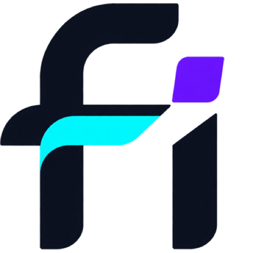

# fi

[English](README.md) | 中文



品牌资源包括[默认 fi 标志](apps/desktop/build/fi-logo-source.png)以及用于深色背景的[透明白色版本](apps/desktop/build/fi-logo-dark-background.png)。

fi 是面向 macOS 与 Windows 的预发布 coding agent 应用。它将原生桌面壳与插件化 agent 运行时组合在一起。

当前 release：`fi Preview 04`（package 版本 `0.1.0-preview.4`）

首个公开 release 提供面向 Apple 芯片 Mac 的签名并公证 macOS 构建。

<a id="run"></a><a id="run-from-source"></a>

## 从源码运行

需要 Node.js `^22.19.0 || >=24.0.0` 与 pnpm `11.7.0`。

```sh
git clone https://github.com/OJamals/fi.git
cd fi
pnpm install
pnpm run dev:desktop
```

使用 `pnpm run build:official` 生成官方 Web 构建。桌面打包、签名与发布命令见 [`apps/desktop`](apps/desktop/README.zh.md)。

## 更新

生产桌面构建从已发布的 [fi GitHub Releases](https://github.com/OJamals/fi/releases) 读取已签名更新元数据。Preview 构建跟随 preview prerelease，稳定构建跟随稳定 release；草稿 release 会被忽略。

## 项目状态

fi 处于预发布阶段，可能发生破坏性变更。使用前请阅读 [SAFETY.zh.md](SAFETY.zh.md)。

fi 基于 [DeepSeek Harness](https://github.com/deepseek-ai/deepseek-harness)，该项目最初由 DeepSeek AI 开发，并使用 [Cordis](https://github.com/cordiverse/cordis)。

## 开发

参见[开发](docs/development.zh.md)、[架构](docs/architecture.zh.md)与[贡献](CONTRIBUTING.zh.md)文档。

`pnpm run dev:web` 会在一个终端里完成构建、启动，并在源码修改时重建 client bundle；`make help` 列出 Web 与 Desktop 对应的 Make target。完整表格见开发指南的「应用命令」一节。

面向 agent：请遵循 [AGENTS.md](AGENTS.md)。

## 许可证

[MIT](LICENSE)。第三方许可证见 [THIRD_PARTY_NOTICES.md](THIRD_PARTY_NOTICES.md)。
